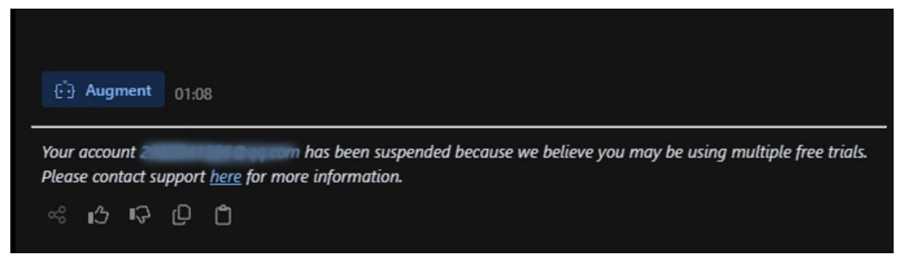
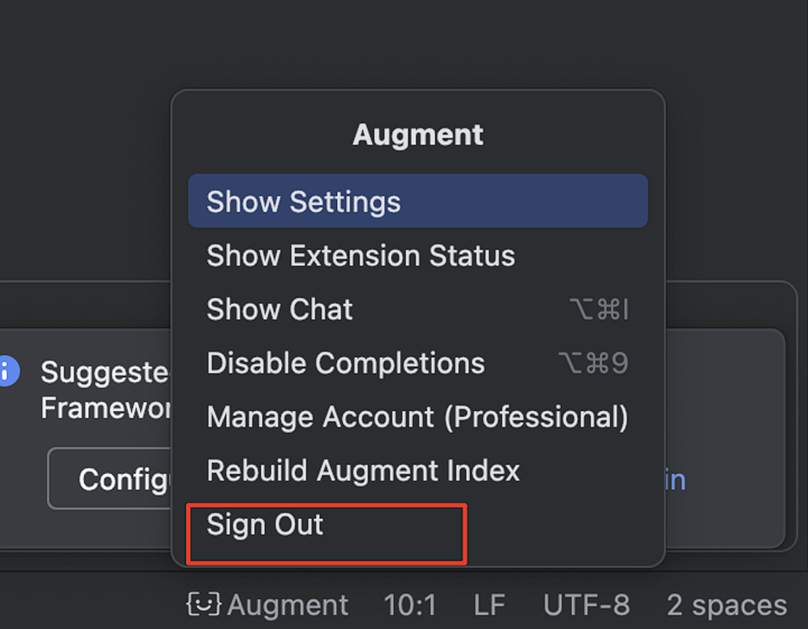
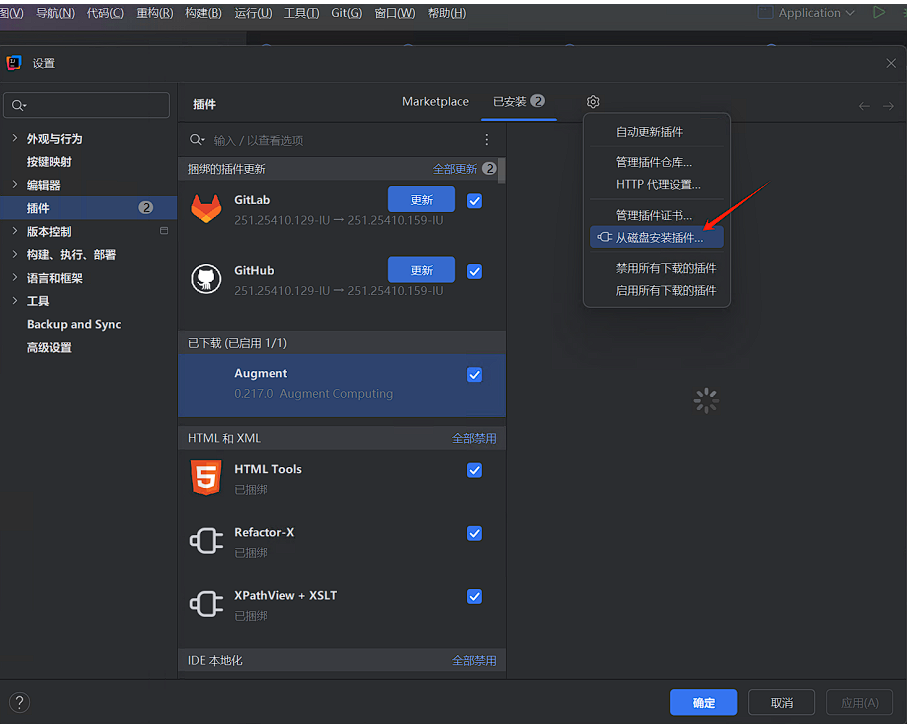
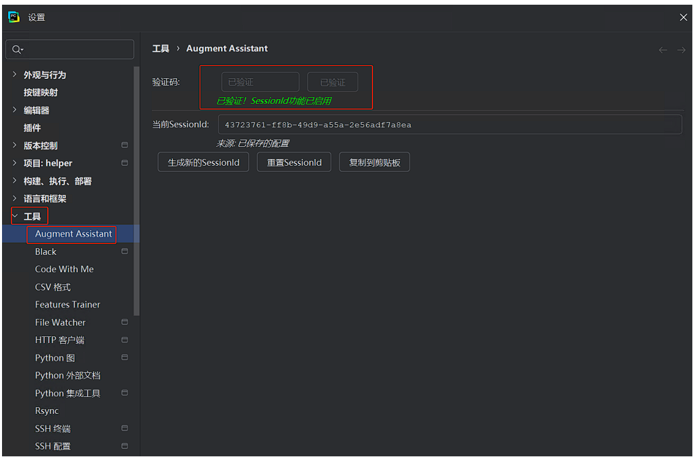

# JetBrains Augment无限续杯

**20250615：更新插件v1.0.1,目前使用正常,可以多试试重新生成SessionId**

## 解决问题：设备受限，注册新账号使用提示如下

## 概述
目前采用的办法是运行时修改相关信息，因为JetBrains IDE的运行环境是在JVM基础上的，
运行时通过Java类反射，能拿到Augment的一些运行环境信息，直接修改掉运行时的信息，伪装新设备信息就可以了。

## 使用指南

### 环境准备
1. 已安装JetBrains系列IDE（IntelliJ IDEA 2025.1.1.1等）
2. 已安装augment插件

### 操作流程
1. **账号退出**
   - 打开IDE设置界面：File > Settings > Plugins
   - 在插件管理界面点击右上角齿轮图标 > Unlink Account

2. **插件安装**
   - 打开插件管理界面：File > Settings > Plugins
   - 点击右上角齿轮图标 > Install Plugin from Disk...
   - 选择本地插件文件：`augment-assistant-1.0.0.jar`

3. **系统配置**
   - 在验证码输入框中填写任意内容，点击验证按钮
   - 验证成功后显示"已验证! SessionId 功能已启用"

4. **会话管理**
   - 点击[生成新的SessionId]按钮获取最新会话标识

5. **账号登录**
   - 访问AugmentCode平台完成正常账号登录流程